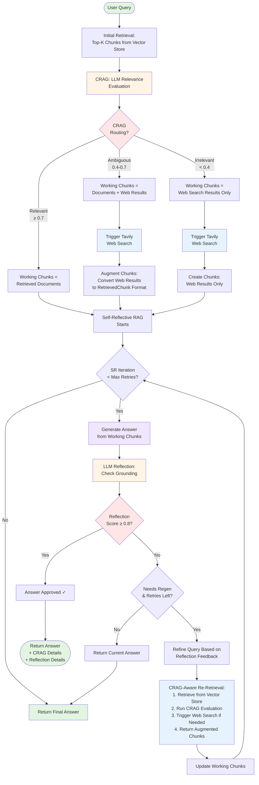

# Both Mode Workflow (CRAG + Self-Reflective)

**Both Mode** combines the strengths of CRAG (adaptive web search) and Self-Reflective RAG (grounding validation) for maximum quality and coverage.

## Workflow Diagram



## Detailed Flow

### Phase 1: CRAG Pre-Processing

**Purpose:** Augment retrieved documents with web search if needed

**Steps:**
1. **Initial Retrieval:** Fetch top-k chunks from vector store
2. **CRAG Evaluation:** LLM evaluates relevance of retrieved docs
3. **Routing Decision:**
   - **Relevant** (≥0.7): Use documents only
   - **Ambiguous** (0.4-0.7): Augment with web search (docs + web)
   - **Irrelevant** (<0.4): Replace with web search only

4. **Web Search Integration:** If triggered, fetch 3 Tavily results
5. **Chunk Conversion:** Convert web results to `RetrievedChunk` format with proper metadata

**Key Enhancement:** Web results are converted to standard chunk format, allowing Self-Reflective RAG to treat them like regular documents.

### Phase 2: Self-Reflective Iteration

**Purpose:** Ensure answer quality through grounding validation

**Input:** CRAG-augmented chunks (may include web results)

**Iteration Loop:**
1. **Generate Answer:** LLM creates answer from working chunks
2. **Reflection Check:** LLM evaluates grounding quality
3. **Score Evaluation:**
   - ≥ 0.8: Approve and return ✓
   - < 0.8: Proceed to refinement
4. **Query Refinement:** LLM refines query based on reflection feedback
5. **CRAG-Aware Re-Retrieval:**
   - Retrieve new chunks with refined query
   - **Run CRAG evaluation again** on new chunks
   - Trigger web search if new chunks are also irrelevant
   - Return augmented chunks (preserves web search capability)
6. **Update Working Chunks:** Replace with new augmented chunks
7. **Repeat:** Until score ≥ 0.8 or max iterations reached

### CRAG-Aware Retrieval Function

**Critical Feature:** The retrieval function used during Self-Reflective refinement is CRAG-aware.

```python
def retrieval_fn(refined_query):
    # Step 1: Retrieve from vector store
    new_chunks = retrieval_service.retrieve(refined_query, top_k)

    # Step 2: Run CRAG evaluation on new chunks
    new_crag_result = crag_service.execute_crag(refined_query, new_chunks)

    # Step 3: Get augmented chunks (triggers web search if needed)
    return crag_service.get_augmented_chunks(new_crag_result)
```

**Why This Matters:**
- Without this, refined queries would lose web search capability
- With this, each refinement iteration can trigger web search if needed
- Ensures consistent behavior across all iterations

## Web Result Conversion

Web search results are converted to proper `RetrievedChunk` format:

```python
ChunkMetadata(
    chunk_id="web_search_0",
    source_file="https://weather.com/...",
    file_type="web_search",  # Identifies web results
    chunk_index=0,
    total_chunks=3,
    chunk_method="web_search",
    token_count=calculated,
    char_count=calculated,
    content_preview="First 100 chars...",
    keywords=[],
    created_at=now,
    processed_at=now
)
```

## Example Flow: Weather Query

**Query:** "What is the weather today in New Delhi?"

**Retrieved Docs:** Climate change research papers (from uploaded PDFs)

---

### CRAG Phase

**Evaluation:**
- Relevance Score: 0.0
- Label: Irrelevant
- Reasoning: "Documents discuss long-term climate patterns, not current weather"

**Action:** Trigger web search

**Web Results:**
1. "Current weather: 23.2°C with mist..." (weather.com)
2. "New Delhi forecast: 18°C-28°C today..." (AccuWeather)
3. "Air quality and conditions..." (local source)

**Working Chunks:** 3 web search results (converted to RetrievedChunk format)

---

### Self-Reflective Phase - Iteration 1

**Generated Answer:**
"Today in New Delhi, the weather is currently 23.2°C (73.8°F) with mist conditions. The temperature is expected to range from 18°C to 28°C..."

**Reflection:**
- answer_grounded: true
- reflection_score: 0.9
- hallucination_detected: false
- sources_cited: ["1", "2"]
- reasoning: "Answer accurately reflects web search results with specific data"

**Result:** ✅ Approved (score ≥ 0.8)

**Final Answer:** Weather information from web search

---

## Example Flow: Document-Based Query with Refinement

**Query:** "What are the impacts of climate change?"

**Retrieved Docs:** General climate overview documents

---

### CRAG Phase

**Evaluation:**
- Relevance Score: 0.6
- Label: Ambiguous
- Reasoning: "Docs have some info but may lack depth"

**Action:** Augment with web search

**Working Chunks:** 5 retrieved docs + 3 web results = 8 total

---

### Self-Reflective Phase - Iteration 1

**Generated Answer:**
"Climate change has various impacts on the environment..."

**Reflection:**
- answer_grounded: true
- reflection_score: 0.5
- reasoning: "Answer is too general, lacks specific examples and quantitative data"
- needs_regeneration: true

**Action:** Refine query

**Refined Query:** "What are specific quantitative impacts of climate change on temperature, sea levels, biodiversity, and extreme weather events?"

---

### CRAG-Aware Re-Retrieval

**New Retrieval:** Fetch chunks for refined query

**New CRAG Evaluation:**
- Relevance Score: 0.8
- Label: Relevant
- Action: Use docs only (no new web search needed)

**New Working Chunks:** 5 detailed climate impact documents

---

### Self-Reflective Phase - Iteration 2

**Generated Answer:**
"Climate change has specific quantifiable impacts: 1) Global temperatures have risen 1.1°C since pre-industrial times. 2) Sea levels are rising at 3.3mm/year. 3) Biodiversity loss has accelerated with 1 million species at risk..."

**Reflection:**
- answer_grounded: true
- reflection_score: 0.95
- hallucination_detected: false
- sources_cited: ["1", "2", "3", "4"]

**Result:** ✅ Approved

---

## Configuration

```env
# CRAG settings
CRAG_RELEVANCE_THRESHOLD=0.7
CRAG_AMBIGUOUS_THRESHOLD=0.5

# Self-Reflective settings
REFLECTION_MIN_SCORE=0.8
MAX_REFLECTION_RETRIES=2

# Web search
TAVILY_API_KEY=your_key_here

# LLM
OPENAI_API_KEY=your_key_here
LLM_MODEL=gpt-4o-mini
```

## Key Advantages

### ✅ Best of Both Worlds

**From CRAG:**
- Adaptive web search when documents are insufficient
- Fresh, real-time information access
- Automatic routing based on relevance

**From Self-Reflective:**
- Quality assurance through grounding checks
- Iterative refinement for better answers
- Source attribution and transparency

### ✅ Preserved Capabilities

- **Web search persists** across refinement iterations
- Each refined query re-runs CRAG evaluation
- Can trigger additional web searches if needed

### ✅ Comprehensive Coverage

- Handles queries requiring current data (via CRAG web search)
- Handles queries needing depth (via Self-Reflective refinement)
- Combines multiple information sources intelligently

## When to Use Each Mode

| Query Type | Recommended Mode | Reasoning |
|------------|-----------------|-----------|
| Current events, weather, stocks | **CRAG** | Needs real-time web data, grounding less critical |
| Complex analysis requiring evidence | **Self-Reflective** | Needs high grounding quality, docs likely sufficient |
| High-stakes queries needing accuracy AND currency | **Both** | Needs both web access and grounding validation |
| Simple factual lookup from docs | **Standard** | No need for overhead of CRAG or reflection |

## Performance Considerations

### Latency
- **CRAG:** +1-2 seconds (web search)
- **Self-Reflective:** +2-6 seconds per iteration (generation + reflection)
- **Both:** Combined overhead, typically 5-10 seconds

### Cost
- **Additional LLM Calls:**
  - CRAG evaluation: 1 call
  - Self-Reflective: 2-6 calls (depends on iterations)
  - Both mode: 3-7+ calls total

### Optimization Tips
1. **Adjust thresholds** to reduce unnecessary web searches
2. **Reduce max iterations** if latency is critical
3. **Use HYDE selectively** (adds cost but improves retrieval)
4. **Monitor reflection scores** to tune REFLECTION_MIN_SCORE

## Response Structure

```json
{
  "query": "user query",
  "answer": "final answer text",
  "mode": "both",
  "sources": [
    {
      "content": "chunk content",
      "score": 0.9,
      "metadata": {
        "chunk_id": "web_search_0",
        "source_file": "https://...",
        "file_type": "web_search"
      }
    }
  ],
  "crag_details": {
    "used_web_search": true,
    "evaluation": {
      "relevance_score": 0.0,
      "relevance_label": "irrelevant",
      "needs_web_search": true
    },
    "web_results": [...]
  },
  "reflection_details": {
    "final_answer": "answer text",
    "iterations": 1,
    "reflection": {
      "answer_grounded": true,
      "reflection_score": 0.9,
      "sources_cited": ["1", "2"]
    }
  }
}
```

## Monitoring & Debugging

**Log Messages to Watch:**
```
Mode=both: Using N chunks for Self-Reflective (M from web search)
CRAG Evaluation: irrelevant (score: 0.00)
CRAG: Triggering web search
Web search returned 3 results
Self-Reflective iteration 1
Reflection score: 0.90, Grounded: True
```

**Success Indicators:**
- Web search triggered when documents are irrelevant ✓
- Web chunks properly converted and passed to Self-Reflective ✓
- Reflection scores improve or stay high ✓
- Final answer includes web search sources when appropriate ✓
