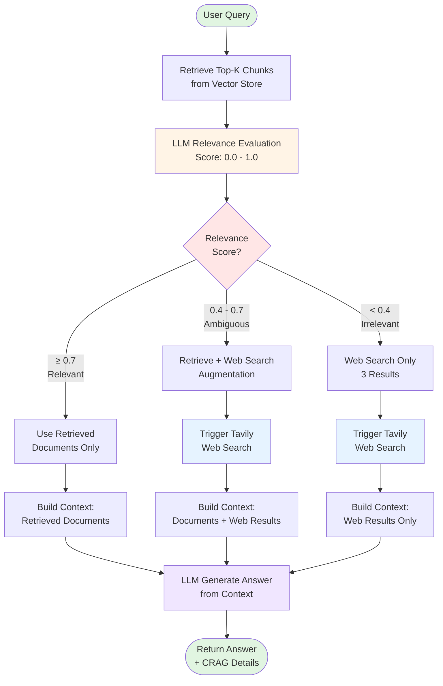

# CRAG Mode Workflow

**Corrective RAG (CRAG)** uses LLM-based relevance evaluation to decide whether to use retrieved documents, augment with web search, or replace with web search entirely.

## Workflow Diagram



## Key Components

### 1. Retrieval
- Fetches top-k chunks from Qdrant vector store
- Uses OpenAI embeddings for similarity search
- Optional: HYDE (Hypothetical Document Embeddings) for query expansion
- Optional: Reranking (local cross-encoder or Voyage AI)

### 2. LLM-Based Relevance Evaluation

**Prompt:** Evaluates retrieved documents against the query

**JSON Response:**
```json
{
  "relevance_score": 0.0-1.0,
  "relevance_label": "relevant|ambiguous|irrelevant",
  "confidence": 0.0-1.0,
  "reasoning": "explanation"
}
```

**Thresholds (configurable in .env):**
- `CRAG_RELEVANCE_THRESHOLD=0.7` → Relevant/Ambiguous cutoff
- `CRAG_AMBIGUOUS_THRESHOLD=0.5` → Ambiguous/Irrelevant cutoff

### 3. Routing Logic

| Label | Score Range | Action |
|-------|-------------|--------|
| **Relevant** | ≥ 0.7 | Use retrieved documents only |
| **Ambiguous** | 0.4 - 0.7 | Use documents + web search augmentation |
| **Irrelevant** | < 0.4 | Replace with web search results only |

### 4. Web Search Integration

- **Provider:** Tavily API
- **Results:** 3 web search results per query
- **Triggers:** When relevance is ambiguous or irrelevant
- **Content:** Title, URL, and text content from web pages

### 5. Context Assembly

**Relevant:**
```
=== Retrieved Documents ===
Document 1: [content]
Document 2: [content]
```

**Ambiguous:**
```
=== Retrieved Documents ===
Document 1: [content]

=== Additional Web Information ===
Web Source 1: [content]
```

**Irrelevant:**
```
=== Web Search Results ===
Source 1 (title): [content]
Source 2 (title): [content]
```

### 6. Answer Generation

- LLM generates answer from assembled context
- Model: Configured via `LLM_MODEL` (default: gpt-4o-mini)
- Max tokens: 500

## Configuration

```env
# Relevance thresholds
CRAG_RELEVANCE_THRESHOLD=0.7
CRAG_AMBIGUOUS_THRESHOLD=0.5

# Web search
TAVILY_API_KEY=your_key_here

# LLM
OPENAI_API_KEY=your_key_here
LLM_MODEL=gpt-4o-mini
```

## Example Flow

**Query:** "What is the weather today in New Delhi?"

**Retrieved Docs:** Climate change research papers

**Evaluation:**
- Relevance Score: 0.0
- Label: Irrelevant
- Reasoning: Documents discuss long-term climate patterns, not current weather

**Action:** Web Search Only

**Web Results:**
1. Current weather from weather.com
2. Temperature and conditions from AccuWeather
3. Weather forecast from local source

**Generated Answer:**
"Today in New Delhi, the weather is currently 23.2°C (73.8°F) with mist conditions..."

## Advantages

✅ **Adaptive:** Automatically routes to best information source
✅ **Fresh Data:** Web search provides up-to-date information
✅ **Efficient:** Only searches web when needed
✅ **Transparent:** Evaluation scores show reasoning

## Use Cases

- Queries requiring current/real-time data (weather, stock prices, news)
- Knowledge gaps in document corpus
- Time-sensitive information
- Factual verification with external sources
