# Hybrid Search Workflow

**Hybrid Search** combines dense semantic vectors (OpenAI embeddings) with sparse keyword vectors (BM25) using Reciprocal Rank Fusion (RRF) to achieve superior retrieval accuracy.

## Complete Hybrid Search Pipeline

```mermaid
flowchart TD
    subgraph Upload["📚 Document Upload & Indexing"]
        Doc([Document Upload]) --> Parse[Docling Parser<br/>Extract Text & Structure]
        Parse --> Chunk[HybridChunker<br/>Split into Chunks]
        Chunk --> DualVec{Generate Dual Vectors}

        DualVec --> Dense[Dense Vector<br/>OpenAI Embedding<br/>1536 dimensions]
        DualVec --> Sparse[Sparse Vector<br/>BM25 Tokenization<br/>Term Frequencies]

        Dense --> Store[(Qdrant Storage<br/>Named Vectors:<br/>dense + sparse)]
        Sparse --> Store
    end

    subgraph Query["🔍 Query Processing"]
        UserQuery([User Query]) --> Mode{Search Mode?}

        Mode -->|dense| DenseMode[Dense Search<br/>Semantic Only]
        Mode -->|sparse| SparseMode[Sparse Search<br/>Keyword Only]
        Mode -->|hybrid| HybridMode[Hybrid Search<br/>RRF Fusion]
    end

    subgraph DenseSearch["🎯 Dense Search Path"]
        DenseMode --> GenDense[Generate Query<br/>Dense Vector<br/>OpenAI Embedding]
        GenDense --> SearchDense[Qdrant Query<br/>using: dense<br/>COSINE similarity]
        SearchDense --> ResultsDense[Semantic Results<br/>Top-K by similarity]
    end

    subgraph SparseSearch["📝 Sparse Search Path"]
        SparseMode --> GenSparse[Generate Query<br/>Sparse Vector<br/>Tokenize + Hash]
        GenSparse --> SearchSparse[Qdrant Query<br/>using: sparse<br/>Term Matching]
        SearchSparse --> ResultsSparse[Keyword Results<br/>Top-K by term freq]
    end

    subgraph HybridSearch["⚡ Hybrid Search Path (RRF)"]
        HybridMode --> GenBoth{Generate Both Vectors}

        GenBoth --> DenseVec[Dense Vector<br/>OpenAI Embedding]
        GenBoth --> SparseVec[Sparse Vector<br/>BM25 Tokens]

        DenseVec --> Prefetch1[Prefetch Dense<br/>Top-K × 3 results]
        SparseVec --> Prefetch2[Prefetch Sparse<br/>Top-K × 3 results]

        Prefetch1 --> RRF[RRF Fusion<br/>Combine Rankings<br/>k = 60]
        Prefetch2 --> RRF

        RRF --> ResultsHybrid[Fused Results<br/>Top-K best combined]
    end

    ResultsDense --> Merge[Merge Results]
    ResultsSparse --> Merge
    ResultsHybrid --> Merge

    subgraph Optional["🔧 Optional Enhancements"]
        Merge --> HYDE{HYDE<br/>Enabled?}
        HYDE -->|Yes| HydeGen[Generate 3<br/>Hypotheses<br/>Multi-query]
        HYDE -->|No| Rerank
        HydeGen --> Rerank{Reranking<br/>Enabled?}

        Rerank -->|Yes| CrossEnc[Cross-Encoder<br/>Reranking<br/>Refine Top-K]
        Rerank -->|No| Final
        CrossEnc --> Final
    end

    Final[Final Retrieved Chunks] --> RAG[RAG Pipeline<br/>CRAG / Self-Reflective / Both]
    RAG --> Answer([Generated Answer])

    style UserQuery fill:#e1f5e1
    style Answer fill:#e1f5e1
    style Mode fill:#ffe6e6
    style RRF fill:#fff4e6
    style Store fill:#e6f3ff
    style Final fill:#f0e6ff
```



## Search Mode Comparison

### 🎯 Dense Search (Semantic)

**How it works:**
1. Convert query to dense vector using OpenAI embeddings (1536 dimensions)
2. Search Qdrant using COSINE similarity on dense vectors
3. Returns top-K semantically similar chunks

**Best for:**
- Conceptual queries ("explain machine learning")
- Synonym matching ("AI" matches "artificial intelligence")
- Paraphrased content
- Abstract concepts

**Example:**
```
Query: "neural network architectures"
Matches: "deep learning models", "artificial neural networks", "CNN and RNN"
```

---

### 📝 Sparse Search (BM25 Keyword)

**How it works:**
1. Tokenize query (lowercase, remove stop words, extract terms)
2. Hash tokens to consistent indices (32-bit hash space)
3. Search Qdrant using sparse vector term matching
4. Returns top-K by term frequency overlap

**Best for:**
- Exact terminology ("TensorFlow", "PyTorch")
- Technical jargon
- Proper nouns
- Specific keywords

**Example:**
```
Query: "TensorFlow implementation"
Matches: Documents containing exact terms "TensorFlow" and "implementation"
```

**Tokenization Process:**
- Input: "Machine Learning Algorithms"
- Lowercase: "machine learning algorithms"
- Remove stop words: ["machine", "learning", "algorithms"]
- Hash to indices: [hash("machine"), hash("learning"), hash("algorithms")]
- Store frequencies: [1.0, 1.0, 1.0]

---

### ⚡ Hybrid Search (RRF Fusion) - **Recommended**

**How it works:**
1. Generate both dense and sparse query vectors
2. Prefetch top-K×3 results from both indices (e.g., 15 if top-K=5)
3. Apply Reciprocal Rank Fusion (RRF) to combine rankings
4. Return top-K from fused results

**RRF Formula:**
```
score(doc) = Σ 1 / (k + rank_i(doc))

where:
- k = 60 (RRF constant)
- rank_i(doc) = rank of document in search method i
```

**Best for:**
- General queries (balances semantic + keyword)
- Maximum accuracy across query types
- Production use cases
- Unknown query patterns

**Example:**
```
Query: "deep learning frameworks"

Dense results:          Sparse results:
1. Neural networks (0.85)   1. TensorFlow guide (8.0)
2. ML frameworks (0.72)     2. PyTorch tutorial (6.0)
3. AI models (0.68)         3. Framework comparison (4.0)

RRF Fusion:
1. TensorFlow guide (combined score)
2. Neural networks (combined score)
3. PyTorch tutorial (combined score)
```

---

## Dual Vector Indexing

Every document chunk gets **two vectors** stored in Qdrant:

```python
{
  "id": "chunk_123",
  "vector": {
    "dense": [0.123, -0.456, ...],  # 1536 float values
    "sparse": {
      "indices": [21515159, 330067090, ...],  # Token hashes
      "values": [2.0, 1.0, ...]              # Term frequencies
    }
  },
  "payload": {
    "content": "Deep learning uses neural networks...",
    "metadata": {...}
  }
}
```

---

## Integration with RAG Modes

Hybrid search works seamlessly with all RAG modes:

| RAG Mode | Search Integration |
|----------|-------------------|
| **Standard** | Retrieval → Hybrid Search → Generate Answer |
| **CRAG** | Retrieval → Hybrid Search → Relevance Check → Web Search (if needed) |
| **Self-Reflective** | Retrieval → Hybrid Search → Answer → Grounding Check → Refine (if needed) |
| **Both** | Retrieval → Hybrid Search → CRAG + Self-Reflective Pipeline |

All modes support all three search modes (dense, sparse, hybrid) via the `search_mode` parameter.

---

## Configuration

### Environment Variables

```bash
# Hybrid Search Settings
HYBRID_SEARCH_ENABLED=true        # Enable/disable hybrid search
SPARSE_VECTOR_ENABLED=true        # Enable/disable sparse vectors
RRF_K=60                          # RRF fusion parameter (default: 60)
```

### API Request

```json
{
  "query": "machine learning algorithms",
  "mode": "both",
  "search_mode": "hybrid",  // "dense" | "sparse" | "hybrid"
  "top_k": 5,
  "enable_hyde": true,
  "enable_reranking": true
}
```

---

## Performance Characteristics

| Metric | Dense | Sparse | Hybrid |
|--------|-------|--------|--------|
| **Latency** | ~100ms | ~80ms | ~120ms |
| **Recall** | High (semantic) | Medium (keywords) | **Highest** |
| **Precision** | Medium | High (exact) | **Highest** |
| **Robustness** | Synonym-aware | Exact-match | **Best of both** |

---

## Technical Implementation

### Sparse Vector Generation

```python
class SparseVectorService:
    def generate_sparse_vector(self, text: str) -> SparseVector:
        # 1. Tokenize (lowercase, regex, remove stop words)
        tokens = self.tokenize(text)

        # 2. Count term frequencies
        term_freqs = Counter(tokens)

        # 3. Hash tokens to indices (32-bit)
        indices = [abs(hash(token)) % (2**32) for token in term_freqs.keys()]
        values = [float(freq) for freq in term_freqs.values()]

        return SparseVector(indices=indices, values=values)
```

### Hybrid Search Query

```python
# Prefetch from both indices
results = qdrant_client.query_points(
    collection_name="crag_documents",
    prefetch=[
        Prefetch(query=sparse_query, using="sparse", limit=top_k * 3),
        Prefetch(query=dense_query, using="dense", limit=top_k * 3)
    ],
    query=FusionQuery(fusion=Fusion.RRF),
    limit=top_k
)
```

---

## Key Benefits

✅ **Best of Both Worlds**: Combines semantic understanding with exact keyword matching
✅ **Robust to Query Variations**: Works for conceptual and specific queries
✅ **RRF Fusion**: Intelligently merges rankings from incompatible scoring systems
✅ **No Extra Latency**: Dual vectors indexed simultaneously, minimal overhead
✅ **Production Ready**: Compatible with all RAG modes, HYDE, and reranking
✅ **Transparent**: Users control search mode via API parameter

---

## Research References

- **Dense Retrieval**: [DPR (Dense Passage Retrieval)](https://arxiv.org/abs/2004.04906)
- **Sparse Retrieval**: [BM25 and Beyond](https://www.staff.city.ac.uk/~sbrp622/papers/foundations_bm25_review.pdf)
- **Hybrid Search**: [RRF Fusion in Information Retrieval](https://plg.uwaterloo.ca/~gvcormac/cormacksigir09-rrf.pdf)
- **Qdrant Sparse Vectors**: [Sparse Vector Documentation](https://qdrant.tech/documentation/concepts/sparse-vectors/)
