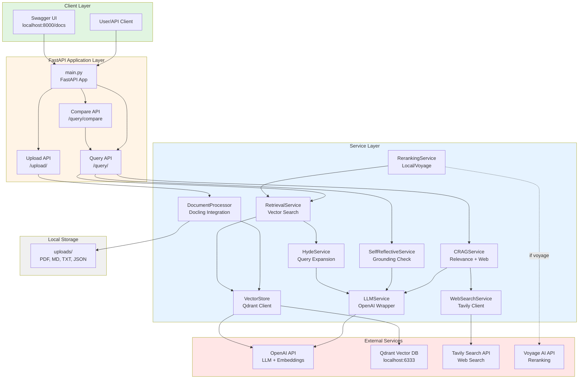
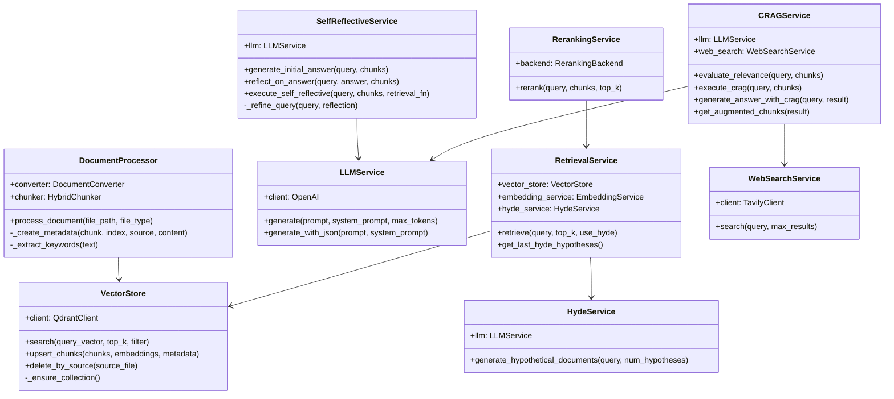
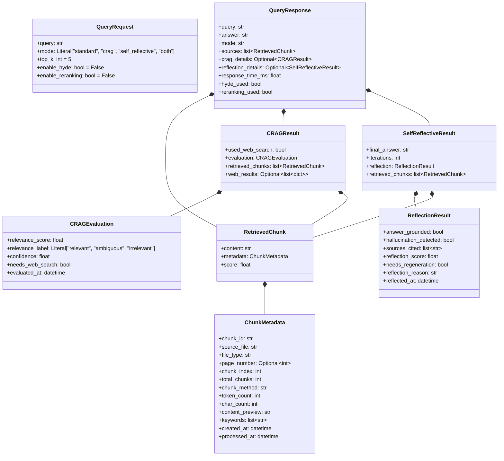
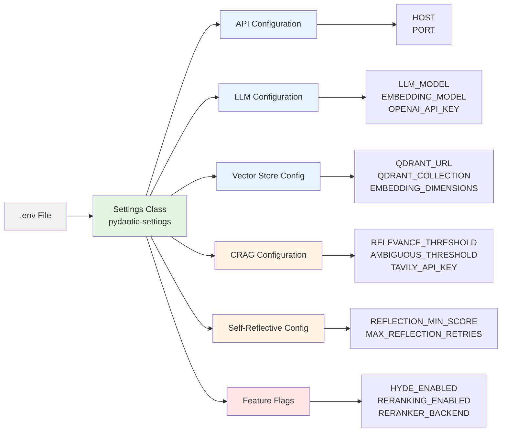
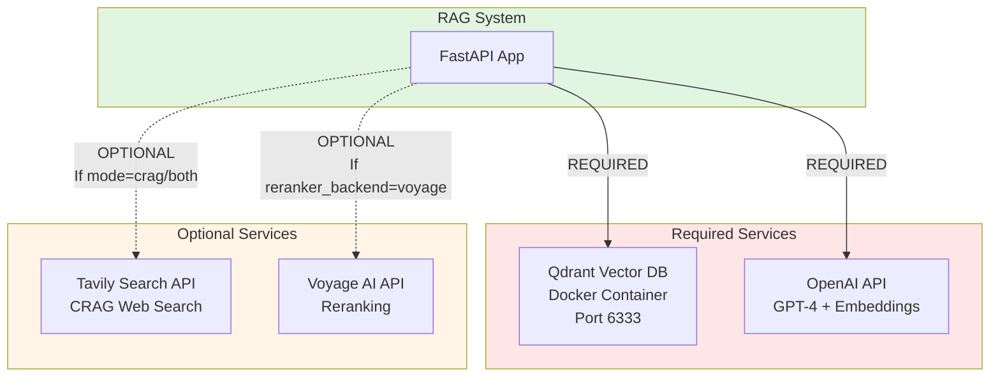
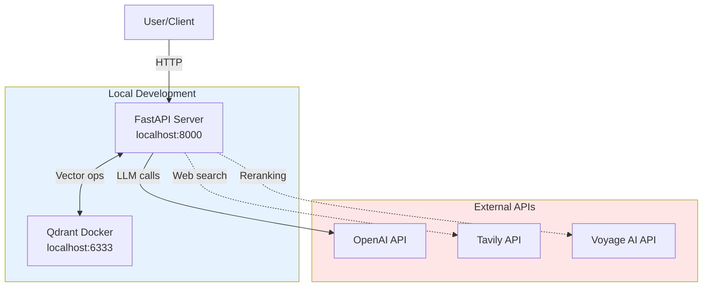
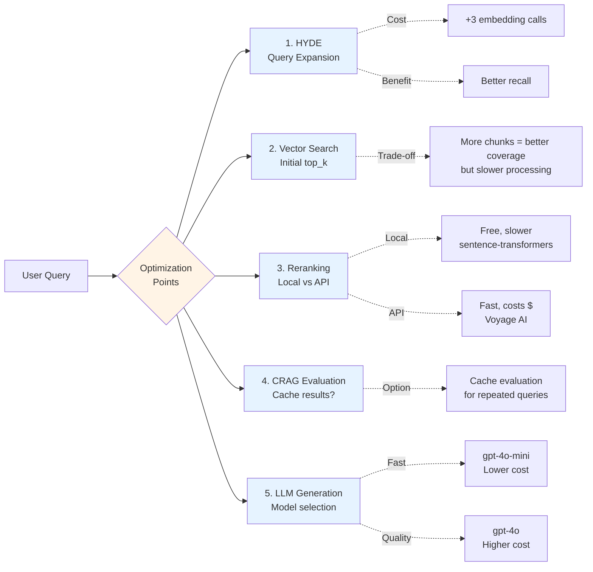
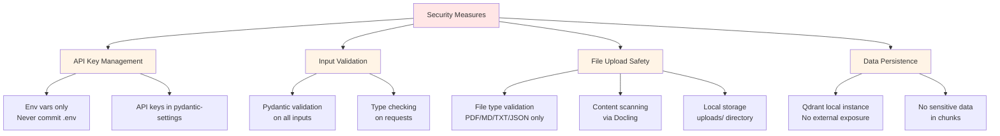

# Project Architecture

Complete architectural overview of the Corrective RAG + Self-Reflective RAG system.

## System Architecture Overview




## Service Layer Architecture



## Data Models Hierarchy




## Configuration Flow



## External Dependencies



## Deployment Architecture




## Performance Optimization Points



## Key Design Decisions

### 1. **Synchronous Service Layer**
- All services are synchronous (not async)
- FastAPI runs them in thread pool
- Simplifies implementation, sufficient for current scale

### 2. **Pydantic for Everything**
- Request/response validation
- Configuration management (pydantic-settings)
- Data models with strict typing
- Automatic serialization/deserialization

### 3. **Service Initialization Pattern**
```python
# Services initialized at module level (query.py, upload.py)
retrieval_service = RetrievalService()
crag_service = CRAGService()
# Shared across requests, stateless
```

### 4. **Metadata Standardization**
- All chunks (docs + web) use same `ChunkMetadata` structure
- `file_type` distinguishes source ("pdf", "web_search", etc.)
- Enables uniform handling in Self-Reflective RAG

### 5. **CRAG-Aware Retrieval in Both Mode**
- Retrieval function re-runs CRAG on refined queries
- Preserves web search capability across iterations
- Ensures consistent behavior

### 6. **Error Handling Strategy**
- LLM JSON responses wrapped in try/except with fallbacks
- Pydantic validation errors → 422 responses
- Service errors → 500 with logged details
- Graceful degradation (e.g., HYDE falls back to original query)

## Monitoring & Observability

### Logging Strategy

```python
# Using loguru for structured logging
logger.info(f"Retrieved {len(chunks)} chunks for query")
logger.warning(f"Could not extract page number: {e}")
logger.error(f"Search error: {e}")
```

**Key Log Points:**
- Document processing: chunk count, file info
- Retrieval: chunk count, HYDE usage
- CRAG: evaluation score, web search trigger
- Self-Reflective: iteration count, reflection scores
- Errors: full exception details

### Metrics to Track

| Metric | Location | Purpose |
|--------|----------|---------|
| **Response Time** | query.py | Performance monitoring |
| **Chunk Count** | retrieval.py | Retrieval effectiveness |
| **CRAG Scores** | crag.py | Relevance distribution |
| **Reflection Scores** | self_reflective.py | Quality assessment |
| **Iteration Count** | self_reflective.py | Refinement frequency |
| **Web Search Triggers** | crag.py | CRAG usage patterns |
| **LLM Token Usage** | llm_service.py | Cost tracking |

## Security Considerations



## Future Enhancement Opportunities

1. **Async Implementation**
   - Convert services to async/await
   - Parallel LLM calls where possible
   - Async vector operations

2. **Caching Layer**
   - Redis for CRAG evaluation results
   - Embedding cache for repeated queries
   - LLM response cache

3. **Batch Processing**
   - Bulk document uploads
   - Batch query processing
   - Parallel chunk embedding

4. **Advanced Reranking**
   - Multi-stage reranking pipeline
   - Learned reranking models
   - Context-aware reranking

5. **Monitoring Dashboard**
   - Real-time metrics visualization
   - Query analytics
   - Performance trends

6. **Multi-Modal Support**
   - Image embedding and retrieval
   - Audio transcription integration
   - Video content processing

## Getting Started

```bash
# 1. Clone and setup
cd corrective_self_reflective_rag
cp .env.example .env
# Edit .env with your API keys

# 2. Start Qdrant
docker run -p 6333:6333 -p 6334:6334 qdrant/qdrant

# 3. Install dependencies
uv sync

# 4. Start server
uv run uvicorn app.main:app --reload --host 0.0.0.0 --port 8000

# 5. Access Swagger UI
open http://localhost:8000/docs

# 6. Upload documents
curl -X POST http://localhost:8000/upload/ \
  -F "file=@document.pdf"

# 7. Query
curl -X POST http://localhost:8000/query/ \
  -H "Content-Type: application/json" \
  -d '{"query": "Your question?", "mode": "both"}'
```

## Related Documentation

- **[workflows/README.md](./README.md)** - Workflow index
- **[workflows/crag_mode.md](./crag_mode.md)** - CRAG workflow details
- **[workflows/self_reflective_mode.md](./self_reflective_mode.md)** - Self-Reflective workflow
- **[workflows/both_mode.md](./both_mode.md)** - Combined workflow
- **[.env.example](../.env.example)** - Configuration reference
