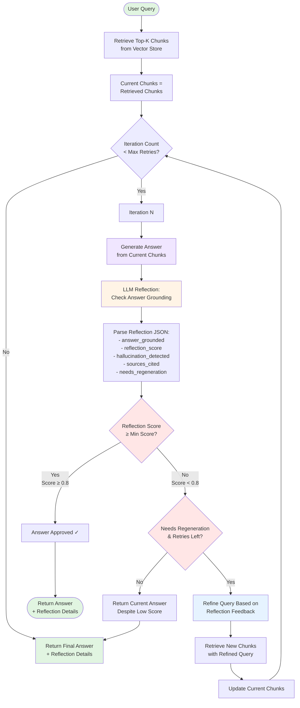

# Self-Reflective Mode Workflow

**Self-Reflective RAG** uses iterative LLM-based grounding checks to ensure answers are well-supported by retrieved documents. If grounding is insufficient, it refines the query and retrieves again.

## Workflow Diagram



## Key Components

### 1. Initial Retrieval
- Fetches top-k chunks from Qdrant vector store
- Uses OpenAI embeddings for similarity search
- Optional: HYDE for query expansion
- Optional: Reranking for better chunk selection

### 2. Iterative Refinement Loop

**Max Iterations:** Configured via `MAX_REFLECTION_RETRIES` (default: 2)

**Each Iteration:**
1. Generate answer from current chunks
2. Reflect on answer quality
3. Check if grounding meets threshold
4. If not, refine query and retrieve again

### 3. Answer Generation

**Prompt Template:**
```
Answer the following query using the provided documents.

Query: {query}

Documents:
Document 1: {content}
Document 2: {content}
...

Provide a clear, accurate answer.
```

**Model:** Uses `LLM_MODEL` (default: gpt-4o-mini)
**Max Tokens:** 500

### 4. LLM-Based Reflection

**Prompt:** Evaluates if the answer is grounded in the documents

**JSON Response:**
```json
{
  "answer_grounded": true/false,
  "hallucination_detected": true/false,
  "reflection_score": 0.0-1.0,
  "sources_cited": ["1", "2", "3"],
  "reflection_reason": "explanation",
  "needs_regeneration": true/false
}
```

**Criteria:**
- **answer_grounded:** All claims supported by documents?
- **hallucination_detected:** Information NOT in documents?
- **reflection_score:** Overall quality (1.0 = perfect, 0.0 = unsupported)
- **sources_cited:** Document numbers that support the answer
- **needs_regeneration:** Should retry with better retrieval?

**Threshold:** `REFLECTION_MIN_SCORE=0.8` (configurable in .env)

### 5. Query Refinement

When grounding is insufficient, the LLM refines the query:

**Refinement Prompt:**
```
The original query didn't retrieve good enough information.
Refine the query to get better results.

Original Query: {query}
Reflection Feedback: {reflection_reason}

Provide a refined query that might retrieve more relevant information.
```

**Example:**
- Original: "What are the impacts of climate change?"
- Reflection: "Answer lacks specific examples and quantitative data"
- Refined: "What are specific quantitative impacts of climate change on temperature, sea levels, and extreme weather events?"

### 6. Re-Retrieval

- Refined query → New embeddings → Vector search
- Fetches fresh top-k chunks
- Replaces previous chunks for next iteration

## Configuration

```env
# Reflection settings
REFLECTION_MIN_SCORE=0.8
MAX_REFLECTION_RETRIES=2

# LLM
OPENAI_API_KEY=your_key_here
LLM_MODEL=gpt-4o-mini

# Vector store
QDRANT_URL=http://localhost:6333
QDRANT_COLLECTION_NAME=crag_documents
```

## Example Flow

**Query:** "What is the impact of climate change on biodiversity?"

**Iteration 1:**

**Retrieved Docs:** General climate overview documents

**Generated Answer:**
"Climate change affects ecosystems and species distribution."

**Reflection:**
- answer_grounded: false
- reflection_score: 0.4
- reflection_reason: "Answer is too vague, lacks specific examples and mechanisms"
- needs_regeneration: true

**Refined Query:**
"What are the specific mechanisms and examples of how climate change impacts biodiversity, including species extinction rates and habitat loss?"

---

**Iteration 2:**

**Retrieved Docs:** Detailed biodiversity impact studies

**Generated Answer:**
"Climate change impacts biodiversity through multiple mechanisms: 1) Rising temperatures force species to migrate poleward at an average rate of 17km per decade. 2) Ocean acidification has increased by 30% since pre-industrial times, threatening marine ecosystems..."

**Reflection:**
- answer_grounded: true
- reflection_score: 0.9
- hallucination_detected: false
- sources_cited: ["1", "2", "3"]

**Result:** Answer approved ✓

## Decision Flow

```
Reflection Score → Action

≥ 0.8  → ✅ Approve answer, return immediately
< 0.8  → ⚠️  Check if retries available
         ├─ Yes → Refine query and retry
         └─ No  → Return current answer with warning
```

## Advantages

✅ **Quality Control:** Ensures answers are well-grounded
✅ **Self-Correcting:** Automatically refines when quality is low
✅ **Transparent:** Provides grounding scores and cited sources
✅ **Iterative:** Gets better information through query refinement

## Limitations

⚠️ **Latency:** Multiple iterations increase response time
⚠️ **Cost:** Each iteration = additional LLM calls
⚠️ **Bounded:** Limited by max retries (may still return poor answers)
⚠️ **Document-Bound:** Can't answer if information isn't in corpus

## Use Cases

- High-stakes queries requiring factual accuracy
- Complex analytical questions needing detailed evidence
- Scenarios where hallucinations must be minimized
- Educational/research contexts requiring source attribution
- Compliance/legal use cases needing verifiable answers

## Monitoring

**Key Metrics to Track:**
- Average reflection score across queries
- Iteration distribution (how often queries need refinement)
- Hallucination detection rate
- Query refinement success rate (score improvement)
